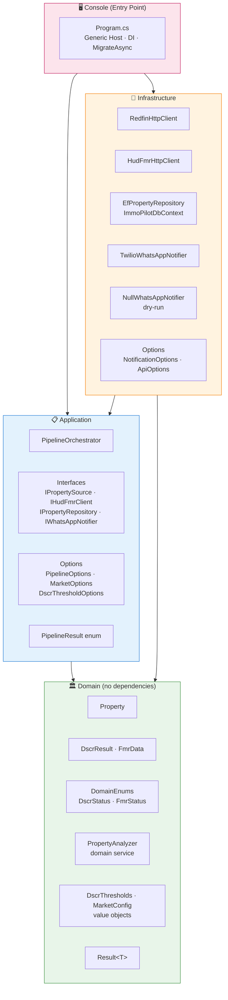
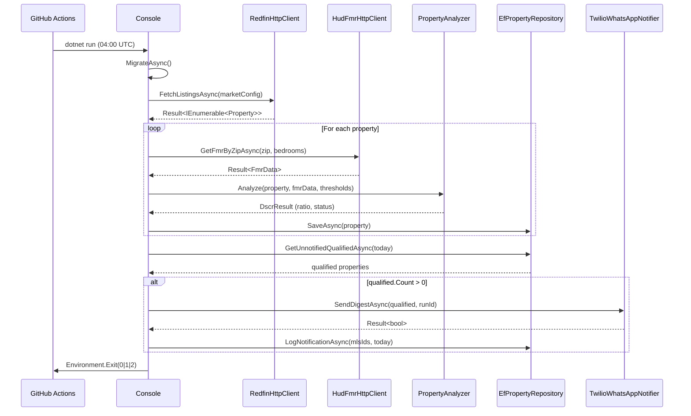
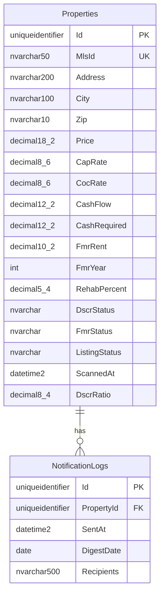

# Architecture Technique — ImmoPilot

## Vue d'ensemble

ImmoPilot suit une **Clean Architecture** en 4 couches concentriques. Les dépendances ne pointent que vers l'intérieur : le domaine ne connaît rien des couches externes.



## Flux de données



## Couches

### Domain (`ImmoPilot.Domain`)

Aucune dépendance externe. Contient la logique métier pure.

| Élément | Rôle |
|---|---|
| `Property` | Entité principale — données Redfin + enrichissement FMR/DSCR |
| `DscrResult` | Record immuable renvoyé par l'analyse |
| `FmrData` | Données HUD Fair Market Rent |
| `DscrThresholds` | Value object — seuils DSCR configurables |
| `MarketConfig` | Value object — configuration du marché |
| `PropertyAnalyzer` | Service domaine statique — calcule le ratio DSCR |
| `Result<T>` | Monade résultat — pas d'exceptions pour les cas métier |
| `DscrStatus` | `Qualified` / `Warning` / `Rejected` |

**Formule DSCR :**
```
DSCR = (FMR × 12 × (1 − VacancyRate − OpexRate))
       ─────────────────────────────────────────────
       LoanAmount × (r×(1+r)³⁶⁰)/((1+r)³⁶⁰−1) × 12
```

### Application (`ImmoPilot.Application`)

Orchestre les cas d'usage. Dépend uniquement du domaine.

| Élément | Rôle |
|---|---|
| `IPropertySource` | Contrat d'accès aux annonces Redfin |
| `IHudFmrClient` | Contrat d'accès aux données HUD FMR |
| `IPropertyRepository` | CRUD + déduplication des notifications |
| `IWhatsAppNotifier` | Contrat d'envoi WhatsApp |
| `PipelineOrchestrator` | Coordination complète du pipeline |
| `PipelineResult` | Enum → code de sortie Unix (0/1/2) |
| `*Options` | Options typées lues depuis la configuration |

### Infrastructure (`ImmoPilot.Infrastructure`)

Implémente les interfaces de l'Application.

| Élément | Technologie | Rôle |
|---|---|---|
| `RedfinHttpClient` | `HttpClient` + Polly | Télécharge le CSV Redfin |
| `HudFmrHttpClient` | `HttpClient` + Polly | Interroge l'API HUD |
| `ImmoPilotDbContext` | EF Core 10 / Azure SQL | Contexte base de données |
| `EfPropertyRepository` | EF Core | Persistance + logs notifications |
| `TwilioWhatsAppNotifier` | Twilio SDK | Envoi réel WhatsApp |
| `NullWhatsAppNotifier` | — | No-op pour dry-run |

Toutes les requêtes HTTP utilisent `AddStandardResilienceHandler()` (Polly).

### Console (`ImmoPilot.Console`)

Point d'entrée unique. Câble le tout via **Generic Host**.

```
Program.cs
  ├── UseSerilog()           → logs structurés console
  ├── ConfigureAppConfiguration() → appsettings.json + variables d'env
  ├── ConfigureServices()    → DI : EF Core, HTTP clients, notifier, orchestrator
  ├── MigrateAsync()         → migrations EF appliquées au démarrage
  ├── PipelineOrchestrator.RunAsync()
  └── Environment.Exit(0|1|2)
```

## Schéma de la base de données



## Dépendances NuGet

| Package | Version | Usage |
|---|---|---|
| `Microsoft.EntityFrameworkCore.SqlServer` | 10.0.3 | ORM Azure SQL |
| `Microsoft.Extensions.Http.Resilience` | 10.3.0 | Polly retry/circuit-breaker |
| `Serilog.Extensions.Hosting` | 10.0.0 | Logs structurés |
| `Serilog.Sinks.Console` | 6.1.1 | Sortie console formatée |
| `Twilio` | 7.14.3 | SDK WhatsApp |
| `Microsoft.Extensions.Hosting` | 10.0.3 | Generic Host |
| `xunit` | 2.9.3 | Tests unitaires |
| `Reqnroll.xUnit` | 3.3.3 | Tests BDD (successeur SpecFlow) |
| `NSubstitute` | 5.3.0 | Mocking |
| `Shouldly` | 4.3.0 | Assertions (MIT) |

## Décisions d'architecture

### `Result<T>` au lieu des exceptions
Les erreurs prévisibles (FMR indisponible, échec HTTP) retournent `Result<T>.Fail(message)`. Seules les exceptions système inattendues remontent. Cela rend le flux de contrôle explicite dans `PipelineOrchestrator`.

### `PropertyAnalyzer` comme service domaine statique
Le calcul DSCR est de la logique métier pure, sans état et sans I/O. Une classe statique dans `Domain/Services/` est l'expression la plus directe de ce fait — testable unitairement sans mock.

### Deux implémentations de `IWhatsAppNotifier`
`TwilioWhatsAppNotifier` pour la production, `NullWhatsAppNotifier` pour le dry-run. Le choix est fait au démarrage dans `Program.cs` selon `Pipeline:DryRun`, sans aucun `if` dans l'orchestrateur.

### Entités EF séparées des entités Domain
`PropertyEntity` (Infrastructure) ≠ `Property` (Domain). Le mapping explicite dans `EfPropertyRepository` isole complètement le schéma SQL du modèle domaine.
